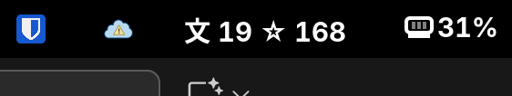

# Top bar indicator for pending Anki and Bunpro reviews

Uses [Argos](https://aur.archlinux.org/packages/argos) to display the results of a query to the Anki connect API (local) and the (deprecatred )Bunpro API. This uses the token in the cookie in the browser rather than the one in your profile settings page, as that one doesn't seem to actually work anymore.

## Requirements
- Anki connect and anki running (theres no remote anki api)
- Microsoft Edge (can probably alter code for any other browser that `browser_cookie3` supports)
- Have accessed the Bunpro website via edge, so that the bunpro.jp's `frontend_api_token` cookie gets populated (this seems to get cycled frequently, so make sure you main way to use bunpro is via the browswer)

## Installation

1. Install Argos into your GNOME desktop
1. Move the script into the Argos folder (ie `~/.config/argos/`)

## Notes

Argos can do multiline outputs and links, so could be fun to extend with more info about each deck for anki in the dropdown. Could also make it so that there is a quick link to launch anki/bunpro from the indicator too.

Note, that Anki API doesnt have any way to filter out due cards from the total that are for decks that have the daily reviews set to 0. So if you have 'disabled' a deck but some cards are still due for it (you are basically ignoring them), then they will still show in the total.

